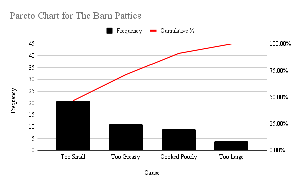

# Restaurant Case Study – Patty Size & Quality Analysis

**Role:** Data Analyst • **Tools:** Excel, R (SPC/ANOVA), Survey Data • **Timeline:** Fall 2024

---

## Overview
This project analyzes patty size and quality consistency at **UCR’s “The Barn” restaurant**.  
We combined **observational data** (hourly patty weights for chicken, beef, and soy over 3 days) with a **customer survey (45 responses)** to investigate complaints about portion sizes and quality.

---

## Objectives
- Assess whether patty sizes were consistent and “in control.”
- Identify top drivers of customer dissatisfaction.
- Provide recommendations to improve standardization and perceived value.

---

## Data
- **Patty weights:** Collected hourly, 11am–8pm, across 3 days for chicken, beef, and soy (30 observations each).
- **Survey responses:** 45 students; complaints categorized as:
  - Too small (46.7%)
  - Too greasy (24.4%)
  - Cooked poorly (20%)
  - Too big (8.9%)

---

## Methods
- **X-bar Control Charts** – tested for statistical process control (Western Electric rules).
- **Pareto Analysis** – ranked complaints by frequency.
- **ANOVA** – checked for mean size differences across days for each patty type.

---

## Key Findings
- All patties were statistically “in control,” but **chicken showed the most within-day variation**.
- “Too small” was the #1 complaint (≈47%), followed by “too greasy” and “cooked poorly.”
- ANOVA found no significant day-to-day differences (issues likely operational, not systematic).

---

## Recommendations
- Reinforce **portioning SOPs** and use of scales.
- Provide **refresher staff training** to reduce within-day variance.
- Review **supplier specs** to tighten size tolerances.
- Prioritize “too small” complaints to improve perceived value.

---
## Artifacts

### Full Report
- 📄 [Full Report (PDF)](./docs/Restaurant_Case_Study.pdf)

### Key Visuals
- Control Chart (Chicken Patties)  
  

- Pareto of Customer Complaints  
    

➡️ More charts available in the [`/assets`](./assets) folder.

### Data
- 🗂️ Sample anonymized data: [`/data`](./data)

---

## License
- Code/scripts: MIT © Ryan Shahidi 2025  
- Report & images: CC BY-NC 4.0
